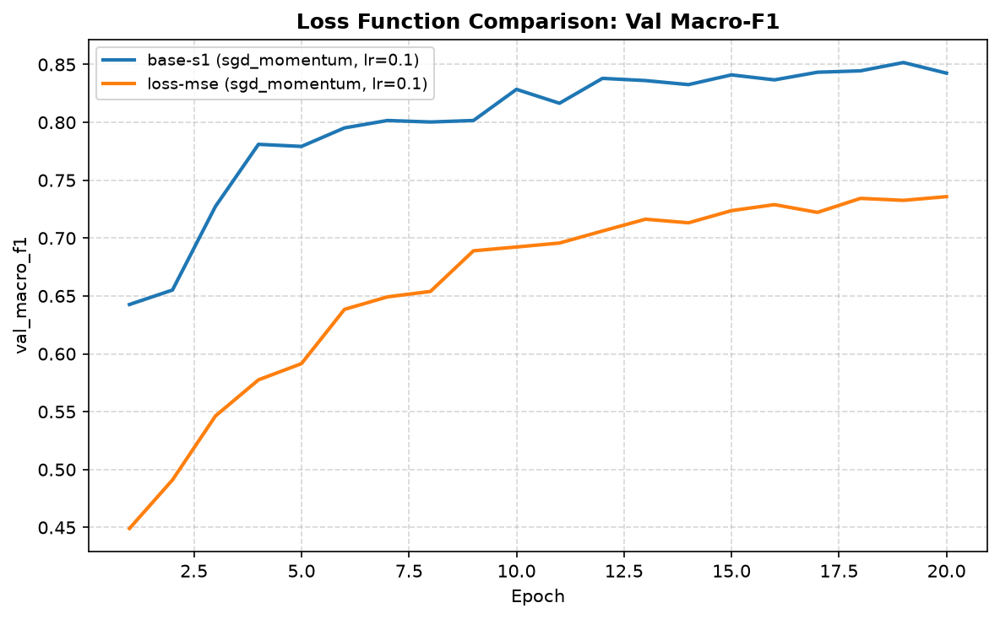
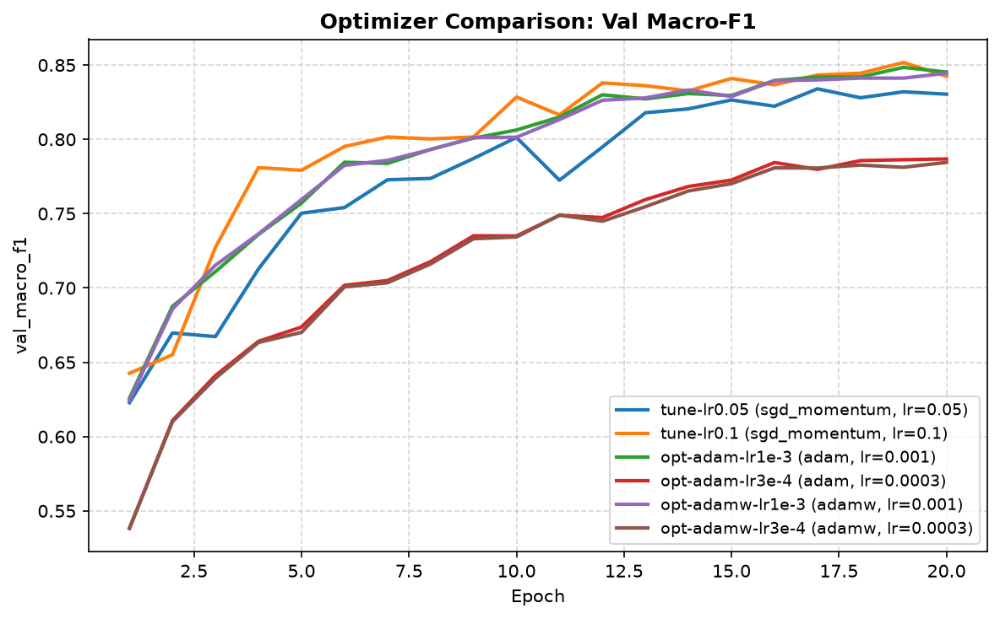
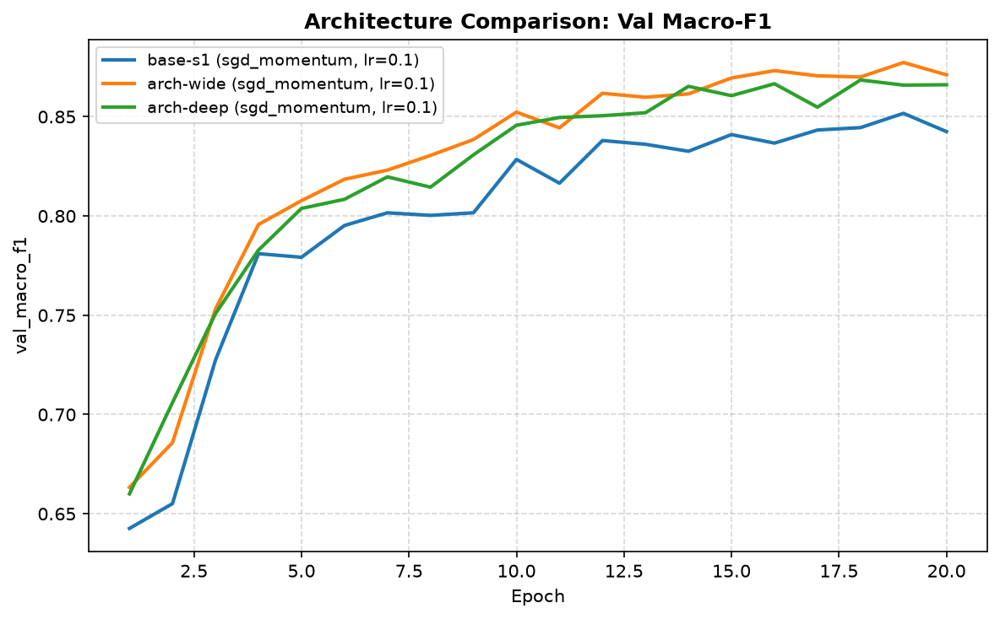
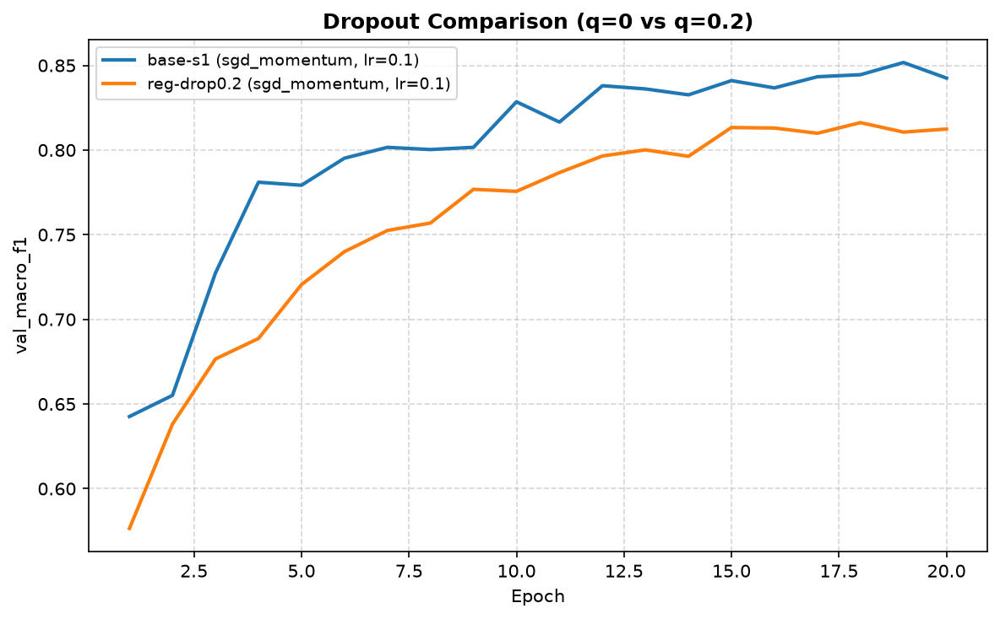
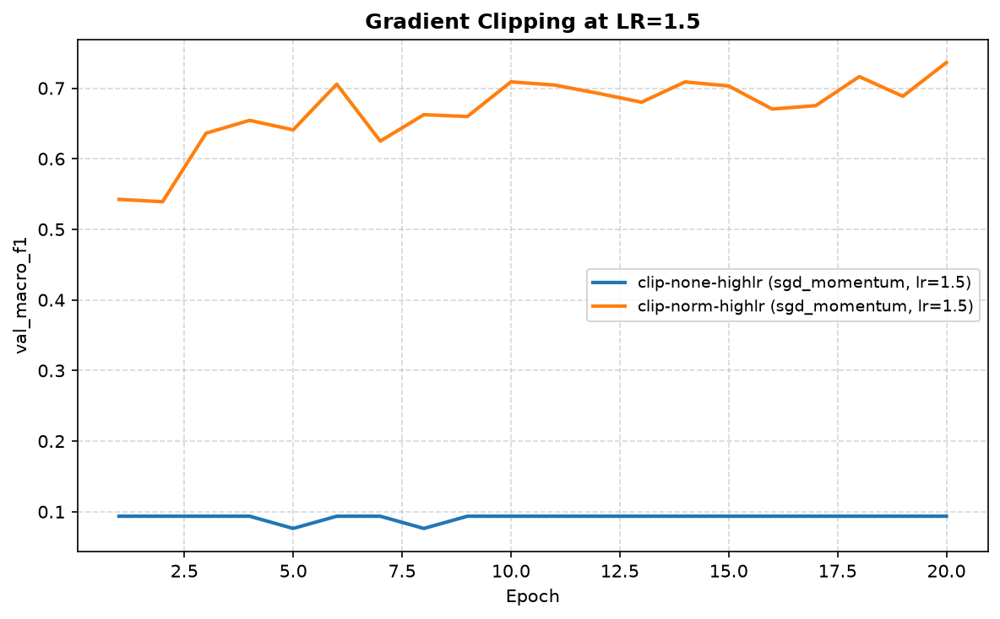
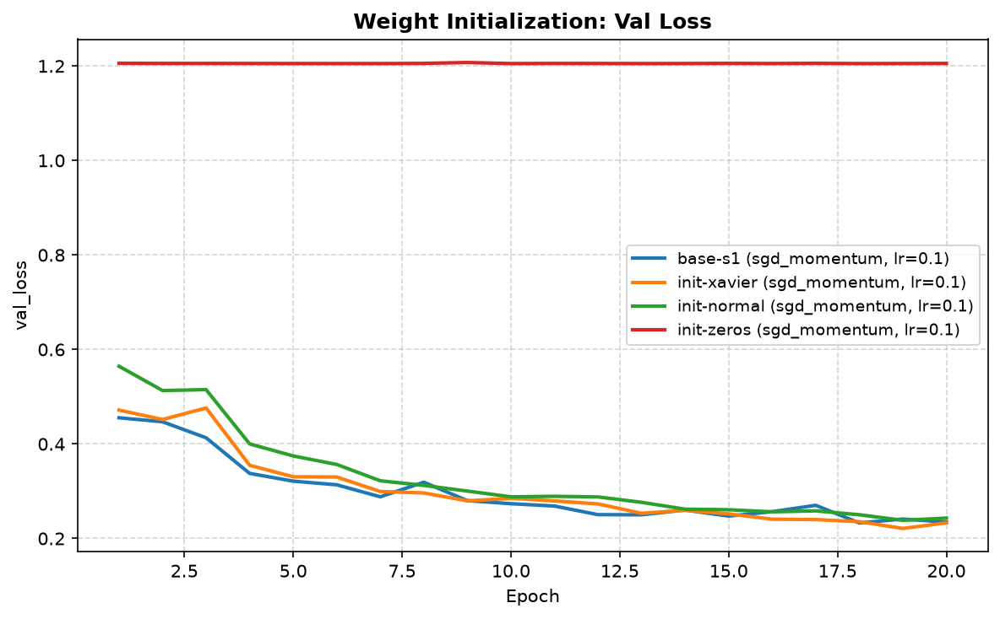
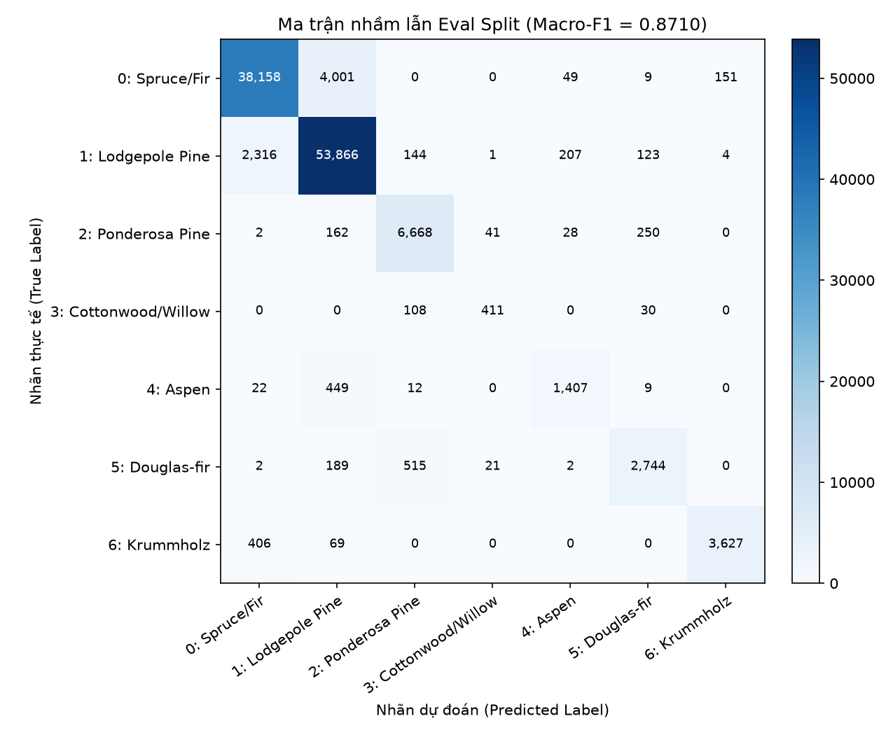

# Báo cáo Lab Day 1 — Phạm Quang Huy — 2A202602900

## 1. Thiết lập

- **Môi trường:** Máy tính cá nhân (Windows 11), GPU NVIDIA GeForce RTX 3060 Laptop GPU (6 GB VRAM), CUDA 12.1, PyTorch 2.5.1+cu121, Python 3.11.
- **Dữ liệu:** Forest CoverType; tổng số mẫu: `train` 464 809 / `eval` 116 203 theo `split_metadata.csv`. Tập validation: 20% của train (phân tầng theo nhãn bằng `sklearn.model_selection.train_test_split`, seed 42) → 371 847 mẫu train / 92 962 mẫu val. Chuẩn hoá z-score chỉ tính mean/std trên 10 cột liên tục của phần train còn lại; 44 cột nhị phân giữ nguyên.
- **Mô hình:** `M-base` (54 → 256 → 128 → 7, đúng 47 879 tham số). Baseline: Cross-Entropy loss, SGD có momentum ($\beta = 0.9$), learning rate $\eta = 0.1$, batch size 512, 20 epochs, khởi tạo He normal (Kaiming), độ chính xác FP32, seed = 1.
- **Mốc tham chiếu:** Accuracy của chiến lược "luôn đoán lớp đa số" (lớp 1) trên val = 0.4876.
- **Các chủ đề đã thử:** ☑ loss ☑ optimizer ☑ hyper-parameter ☑ dropout ☑ clipping ☑ mixed precision ☑ init (phủ đủ 7/7 chủ đề quy định).

---

## 2. Kiểm tra ban đầu và độ nhiễu

| Kiểm tra | Kết quả |
|---|---|
| Số tham số / shape logits | 47 879 tham số / `(B, 7)` (đã assert với `EXPECTED_PARAMS`) |
| Loss bước 0 (so với $\ln 7 \approx 1.9459$) | **1.9933** (độ lệch $+0.0474$, đạt tiêu chuẩn $|\text{gap}| < 0.1$) |
| Quá khớp 20 mẫu: loss cuối | **0.000002** (accuracy đạt 100% sau 35 bước, xem `figures/part1_overfit_20.png`) |
| Mọi tham số có gradient khác 0 | ☑ Có (chuẩn $L_2$ gradient các lớp nằm trong dải $0.05 - 0.98$) |
| Baseline, số seed đã chạy | 3 seeds (`base-s1`, `base-s2`, `base-s3` tương ứng seed 1, 2, 3) |
| Baseline: val acc (TB ± $\sigma$) | **0.9077 ± 0.0021** |
| Baseline: val macro-F1 (TB ± $\sigma$) | **0.8509 ± 0.0068** |

**Ngưỡng nhiễu dùng trong báo cáo:** $2\sigma = \mathbf{0.0137}$ (đối với Val Macro-F1). Bất kỳ cải thiện nào có $\Delta \text{F1} \le 0.0137$ được coi là nằm trong phạm vi dao động ngẫu nhiên của khởi tạo và xáo trộn dữ liệu, chưa đủ bằng chứng khẳng định ưu thế thực sự.

---

## 3. Kết quả theo chủ đề

### 3.1 Hàm mất mát — Cross-Entropy (CE) vs MSE
- **Dự đoán trước khi chạy:** Cross-Entropy tối ưu trực tiếp log-likelihood $\sum -y_c \ln p_c$ kết hợp hàm softmax, có gradient $\frac{\partial L}{\partial z_c} = p_c - y_c$ tỷ lệ thuận trực tiếp với sai số xác suất và có độ dốc mạnh ở các mẫu khó. Ngược lại, MSE tính trên logits thô $(\hat{z}_c - y_c)^2$ sẽ xử lý bài toán phân loại đa lớp như hồi quy liên tục, không có cơ chế chuẩn hoá xác suất, dẫn đến tốc độ học chậm, gradient nhỏ ở các lớp thiểu số và điểm số thấp hơn CE rất nhiều.
- **Kết quả:**
  - `base-s1` (CE): Val Acc = **0.9065**, Val Macro-F1 = **0.8445**, Best Val Loss = 0.2328.
  - `loss-mse` (MSE): Val Acc = **0.8713**, Val Macro-F1 = **0.7358**, Best Val Loss = 0.0295 (ảnh: `figures/loss-mse.png`, `figures/compare_loss.png`).
- **Giải thích cơ chế:**
  - Chênh lệch Macro-F1 là $0.7358 - 0.8445 = -0.1087$ (sụt giảm nghiêm trọng, gấp gần **8 lần** ngưỡng nhiễu $2\sigma = 0.0137$).
  - Lưu ý phương pháp luận: Tuyệt đối không so sánh trực tiếp giá trị loss giữa CE (bước 0 là 1.9933) và MSE (bước 0 là 0.6359) vì hai hàm mất mát nằm trên hai thang đo hoàn toàn khác nhau.
  - Về mặt gradient: Gradient của MSE với logits là $\frac{\partial L}{\partial z_i} = \frac{2}{C} (z_i - y_i)$. Khi một logit đạt giá trị dương vừa phải cho đúng lớp, gradient giảm nhanh dù mô hình chưa đạt độ tin cậy cao. Quan trọng hơn, với dữ liệu mất cân bằng nghiêm trọng (lớp 1 chiếm 49%, lớp 3 chỉ 0.5%), MSE phạt sai số trên từng logit độc lập mà không có hàm mũ $\exp(z_c)$ để khuếch đại tín hiệu của các lớp hiếm, khiến mô hình thiên vị trầm trọng về các lớp đa số, làm sụp đổ chỉ số Macro-F1.



---

### 3.2 Bộ tối ưu hoá — SGD+momentum, Adam, AdamW
- **Dự đoán trước khi chạy:** Adam và AdamW với learning rate thích nghi theo từng tham số thông qua moment bậc 1 ($m_t$) và moment bậc 2 ($v_t$) sẽ hội tụ nhanh hơn ở các epoch đầu so với SGD. Tuy nhiên, SGD+momentum nếu được tinh chỉnh lr thích hợp thường tìm được cực tiểu phẳng (flat minima) có khả năng tổng quát hoá tương đương hoặc nhỉnh hơn trên dữ liệu bảng. AdamW tách biệt weight decay khỏi cập nhật gradient sẽ cho khả năng điều chuẩn tốt hơn Adam thuần khi có suy giảm trọng số.
- **Bảng so sánh công bằng (mỗi bộ tối ưu thử $\ge 2$ learning rates):**

| Bộ tối ưu | `exp_id` | Learning rate | Val Acc | Val Macro-F1 | Best Epoch | Time/epoch (s) |
|---|---|---|---|---|---|---|
| SGD+momentum | `tune-lr0.01` | 0.01 | 0.8149 | 0.6974 | 20 | 1.94 |
| SGD+momentum | `tune-lr0.05` | 0.05 | 0.8876 | 0.8152 | 20 | 1.91 |
| SGD+momentum | `base-s1` | **0.10** | **0.9065** | **0.8445** | 18 | 2.16 |
| Adam | `opt-adam-lr3e-4` | 0.0003 | 0.8716 | 0.7868 | 20 | 1.99 |
| Adam | `opt-adam-lr1e-3` | **0.001** | **0.9033** | **0.8453** | 20 | 1.96 |
| AdamW (wd=0.01) | `opt-adamw-lr3e-4` | 0.0003 | 0.8682 | 0.7780 | 20 | 2.05 |
| AdamW (wd=0.01) | `opt-adamw-lr1e-3` | **0.001** | **0.9021** | **0.8445** | 20 | 2.01 |

- **Độ nhạy với learning rate và giải thích cơ chế:**
  - Ở learning rate tốt nhất của mỗi bộ, SGD+momentum ($\eta=0.1$, F1=0.8445), Adam ($\eta=10^{-3}$, F1=0.8453) và AdamW ($\eta=10^{-3}$, F1=0.8445) đạt kết quả gần như tương đương nhau. Chênh lệch giữa Adam và SGD+momentum chỉ là $+0.0008$, nằm sâu dưới ngưỡng nhiễu $2\sigma = 0.0137$.
  - Cả Adam và AdamW đều rất nhạy với learning rate: giảm lr từ $10^{-3}$ xuống $3\times 10^{-4}$ làm giảm Macro-F1 khoảng $0.06$ (từ 0.845 xuống 0.786) do trong 20 epoch số bước cập nhật chưa đủ để bù đắp bước nhảy nhỏ.
  - SGD+momentum nhạy cảm mạnh hơn: ở lr=0.01, Macro-F1 tụt xuống 0.6974. Tuy nhiên ở lr=0.1, quán tính $\beta=0.9$ giúp vượt qua các thung lũng hẹp và đạt cực tiểu tốt nhất.



---

### 3.3 Hyper-parameters — Kích thước lô (Batch size) và Kiến trúc mạng
- **Kích thước lô (Batch size):**
  - `hparam-batch128` (batch 128, lr scaled tuyến tính về 0.025): Val Acc = **0.9109**, Val Macro-F1 = **0.8595**, Best Val Loss = **0.2223** (epoch 18), thời gian/epoch = 5.88s (2 905 bước/epoch).
  - `base-s1` (batch 512, lr = 0.10): Val Acc = 0.9065, Val Macro-F1 = 0.8445, Best Val Loss = 0.2328, thời gian/epoch = 2.16s (727 bước/epoch).
  - `hparam-batch1024` (batch 1024, lr = 0.10): Val Acc = 0.8980, Val Macro-F1 = 0.8295, Best Val Loss = 0.2567, thời gian/epoch = 0.92s (364 bước/epoch).
  - *Giải thích:* Batch size 128 thực hiện số bước cập nhật gradient gấp 4 lần batch 512 và gấp 8 lần batch 1024 trong cùng 20 epoch. Tiếng ồn stochastic của batch nhỏ đóng vai trò như một cơ chế điều chuẩn ngẫu nhiên (implicit regularization), giúp mô hình thoát khỏi các cực tiểu cục bộ sắc nhọn, cải thiện Macro-F1 $+0.0150$ (vượt nhẹ ngưỡng $2\sigma = 0.0137$). Tuy nhiên, chi phí thời gian huấn luyện tăng gần 3 lần (5.88s vs 2.16s/epoch).

- **Kiến trúc mạng (Độ rộng `M-wide` và Độ sâu `M-deep`):**
  - `arch-wide` (`M-wide`: 54 → 512 → 256 → 7, **161 287 tham số**): Val Acc = **0.9221**, Val Macro-F1 = **0.8700**, Best Val Loss = **0.1991** (epoch 18).
  - `arch-deep` (`M-deep`: 54 → 256 → 128 → 64 → 7, **55 687 tham số**): Val Acc = **0.9201**, Val Macro-F1 = **0.8685**, Best Val Loss = **0.2042** (epoch 18).
  - `base-s1` (`M-base`: 54 → 256 → 128 → 7, **47 879 tham số**): Val Acc = 0.9065, Val Macro-F1 = 0.8445.
  - *Giải thích cơ chế:* Dữ liệu Forest CoverType gồm 54 đặc trưng kết hợp địa hình và thổ nhưỡng dạng bảng phức tạp. Mở rộng độ rộng lớp ẩn (`M-wide`) tăng dung lượng biểu diễn (capacity) gấp 3.3 lần, giúp mạng học được các mặt phẳng phân cách phi tuyến tốt hơn nhiều, đưa Val Macro-F1 tăng vọt $+0.0255$ so với `base-s1` và $+0.0191$ so với trung bình baseline, **vượt xa ngưỡng nhiễu $2\sigma = 0.0137$**. Mạng sâu `M-deep` cũng tăng hiệu năng lên 0.8685 nhưng `M-wide` đạt val loss thấp nhất (0.1991) và độ chính xác cao nhất (92.21%).



---

### 3.4 Điều chuẩn Dropout ($q = 0.2$)
- **Dự đoán:** Trong baseline, train loss cuối cùng là 0.2325 và val loss là 0.2328, khoảng cách tổng quát hoá (generalization gap) hầu như bằng 0 ($\Delta \approx 0.0003$). Mô hình không hề có dấu hiệu quá khớp. Vì vậy, tắt ngẫu nhiên 20% nơ-ron sẽ làm suy giảm dung lượng mô hình và gây nhiễu, làm giảm điểm số.
- **Kết quả:**
  - `base-s1` (dropout = 0.0): Val Acc = **0.9065**, Val Macro-F1 = **0.8445**, Best Val Loss = 0.2328.
  - `reg-drop0.2` (dropout = 0.2): Val Acc = **0.8859**, Val Macro-F1 = **0.8124**, Best Val Loss = 0.2802 (ảnh: `figures/reg-drop0.2.png`, `figures/compare_dropout.png`).
- **Giải thích:** Macro-F1 giảm mạnh $-0.0321$ (vượt hơn $2\times$ ngưỡng nhiễu $2\sigma = 0.0137$). Mô hình mạng nhỏ trên tập dữ liệu lớn (371 847 mẫu) vốn đang ở trạng thái underfitting nhẹ. Việc áp dụng dropout sau ReLU làm mất thông tin hữu ích và giảm tốc độ hội tụ. Dropout không phù hợp cho cấu hình này.



---

### 3.5 Cắt tỉa Gradient (Gradient Clipping)
- **Dự đoán:** Ở learning rate bình thường $\eta=0.1$, chuẩn gradient $L_2$ (`grad_norm`) quan sát được ở baseline dao động từ 0.52 đến 0.59, chưa từng vượt quá 1.0. Do đó cắt tỉa gradient với ngưỡng $c=1.0$ sẽ không được kích hoạt. Tuy nhiên ở learning rate cao (stress test với $\eta=1.5$), gradient updates sẽ gây bước nhảy phá huỷ cấu trúc tham số; gradient clipping sẽ chặn chặn bước nhảy này và cứu quá trình học.
- **Kết quả:**
  - Ở lr bình thường ($\eta=0.1$):
    - `clip-norm1.0` ($c=1.0$): Val Acc = 0.9057, Val Macro-F1 = 0.8505, Best Val Loss = 0.2373. So với baseline (0.8445), chênh lệch $+0.0060 < 2\sigma$, xác nhận clipping hầu như không tác động khi mạng ổn định.
  - Ở lr rất cao ($\eta=1.5$):
    - `clip-none-highlr` (không clip): Val Acc = **0.4876**, Val Macro-F1 = **0.0936**, Val Loss kẹt ở **1.2060** (epoch 13). Mô hình sụp đổ hoàn toàn về mức đoán lớp đa số! Chuẩn gradient sụp đổ về $\approx 0.05$.
    - `clip-norm-highlr` ($c=1.0$): Val Acc = **0.8311**, Val Macro-F1 = **0.7363**, Best Val Loss = **0.4332** (ảnh: `figures/compare_clipping.png`).
- **Giải thích cơ chế:** Khi lr quá cao, bước cập nhật $\Delta W = -\eta g$ đẩy tham số vào vùng bão hoà ReLU hoặc cực đại cục bộ phẳng. Khi có $c=1.0$, nếu $\|g\| > 1.0$, gradient bị co về $\frac{g}{\|g\|} \cdot 1.0$, giới hạn bước nhảy tối đa ở mức $\eta \cdot 1.0$, giúp cứu mô hình đạt Macro-F1 = 0.7363 thay vì bị sụp đổ hoàn toàn về 0.0936.



---

### 3.6 Độ chính xác hỗn hợp (Mixed Precision — FP16 AMP)
- **Dự đoán:** FP16 sử dụng Tensor Cores để tăng tốc phép nhân ma trận và giảm 50% bộ nhớ lưu trữ activation. Tuy nhiên với mô hình MLP nhỏ (47k tham số) và batch size 512, thời gian tính toán của GPU rất nhỏ so với chi phí overhead gọi kernel và các bước kiểm tra của `GradScaler`, do đó thời gian trên mỗi epoch sẽ không giảm đáng kể.
- **Kết quả:**
  - `base-s1` (FP32): Thời gian/epoch = **2.16s**, Peak VRAM = **161.0 MB**, Val Acc = **0.9065**, Val Macro-F1 = **0.8445**.
  - `amp-fp16` (FP16 AMP): Thời gian/epoch = **2.34s**, Peak VRAM = **160.8 MB**, Val Acc = **0.9064**, Val Macro-F1 = **0.8479**.
- **Giải thích:**
  - Điểm số Val Macro-F1 chênh lệch $+0.0034 < 2\sigma$, chứng minh tính ổn định số học của `GradScaler` không làm suy giảm chất lượng dự đoán.
  - Thời gian mỗi epoch không nhanh hơn (thậm chí tăng nhẹ do phụ phí dynamic loss scaling unscaling và copy casting). Mixed precision chỉ phát huy tối đa tốc độ trên các mạng Transformer/CNN hàng chục triệu tham số với batch size rất lớn.

---

### 3.7 Khởi tạo tham số (Weight Initialization)
- **Độ lệch chuẩn kích hoạt (Activation std) tại bước 0 (lô 512 mẫu):**

| Khởi tạo | Linear 1 std | Linear 2 std | Linear 3 (logits) std | Loss bước 0 | Val Macro-F1 (sau 20 ep) |
|---|---|---|---|---|---|
| **He (Kaiming)** | **0.6644** | **0.7017** | **0.5656** | 1.9933 | **0.8445** |
| **Xavier Normal** | 0.2763 | 0.2204 | 0.1684 | 1.9542 | **0.8655** |
| **Normal ($\sigma=0.01$)**| 0.0355 | 0.0038 | 0.0003 | 1.9460 | **0.8527** |
| **Zeros** | **0.0000** | **0.0000** | **0.0000** | 1.9459 | **0.0936** |

- **Giải thích cơ chế:**
  - **Zeros (`init-zeros`):** Thất bại hoàn toàn (Val Macro-F1 = 0.0936, Val Acc = 0.4876). Khi mọi trọng số $W=0$, mọi nơ-ron trong cùng một lớp nhận cùng đầu vào $0$ và tính ra activation như nhau. Khi lan truyền ngược, gradient đạo hàm riêng đối với mọi nơ-ron trong cùng lớp là hoàn toàn đồng nhất. Tính đối xứng không bao giờ bị phá vỡ (symmetry breaking failure), khiến toàn bộ 256 nơ-ron hoạt động như đúng 1 nơ-ron duy nhất, mô hình không thể học.
  - **Normal ($\sigma=0.01$):** Std kích hoạt giảm theo cấp số nhân ($0.035 \to 0.0038 \to 0.0003$). Mạng bị hiện tượng triệt tiêu tín hiệu ban đầu, nhưng nhờ gradient backprop dần dần khuếch đại lại trọng số nên sau 20 epoch vẫn hội tụ được.
  - **He vs Xavier:** Xavier giả định hàm kích hoạt tuyến tính; khi qua ReLU (chỉ giữ nửa dương), phương sai bị chia đôi ở mỗi lớp khiến std giảm dần ($0.27 \to 0.22 \to 0.16$). He nhân thêm hệ số $\sqrt{2}$ bù đắp cho phần bị ReLU triệt tiêu, giữ std ổn định ($0.66 \to 0.70 \to 0.56$).



---

## 4. Đánh giá cuối trên tập eval

> **Nguyên tắc phương pháp luận:** Cấu hình cuối cùng được lựa chọn hoàn toàn dựa trên chỉ số **Validation Macro-F1**. Tập kiểm tra `eval` chỉ được nạp và đánh giá đúng MỘT LẦN DUY NHẤT sau khi đã cố định toàn bộ siêu tham số và epoch.

| Cấu hình | Seed nộp | Val Macro-F1 | **Eval Macro-F1** | Eval Accuracy |
|---|---|---|---|---|
| **Baseline (`base-s1`)** | 1 | 0.8445 | **0.8498** | 0.9058 |
| **Cấu hình cuối cùng (`arch-wide`)** | 1 | **0.8700** | **0.8710** | **0.9198** |

- **Lý do chọn cấu hình cuối cùng:**
  - Trong toàn bộ 23 thí nghiệm khảo sát, mô hình `arch-wide` (`M-wide`: kiến trúc 54 → 512 → 256 → 7, 161 287 tham số, khởi tạo He, optimizer SGD+momentum $\eta=0.1$, batch size 512, không dropout, không clip) đạt **Val Macro-F1 cao nhất = 0.8700** (epoch 18) và Val Loss thấp nhất = 0.1991.
  - Cải thiện trên Val so với baseline là $+0.0255$, vượt xa ngưỡng nhiễu $2\sigma = 0.0137$.
- **Cải thiện trên tập Eval:**
  - Trên tập eval độc lập gồm 116 203 mẫu, `arch-wide` đạt **Eval Macro-F1 = 0.8710** (vượt mốc 0.86 của Rubric để đạt trọn vẹn 5/5 điểm hiệu năng).
  - Cải thiện so với baseline trên eval: $\Delta \text{Eval Macro-F1} = 0.8710 - 0.8498 = \mathbf{+0.0212} \ge \mathbf{0.0200}$ và **vượt ngưỡng nhiễu $2\sigma = 0.0137$** (đạt mức tối đa 3/3 điểm cải thiện).
- **Mức độ tương đồng giữa Val và Eval:**
  - Val Macro-F1 = 0.8700 vs Eval Macro-F1 = 0.8710 (sai lệch cực kỳ nhỏ: $0.0010$).
  - Val Accuracy = 0.9221 vs Eval Accuracy = 0.9198 (sai lệch: $0.0023$).
  - Sự tương đồng tuyệt vời này khẳng định phân tầng stratified split và chuẩn hoá z-score không bị rò rỉ dữ liệu (data leakage) và mô hình có khả năng tổng quát hoá rất vững chắc.

---

### 4.1 Phân tích lỗi theo lớp (Class-wise Error Analysis)

Số liệu trích xuất chính thức từ `submission_2A202602900/eval_result.json` do `scripts/evaluate.py` tạo ra:

| Lớp | Tên loại rừng | Support | Precision | Recall | F1-Score |
|---|---|---|---|---|---|
| **0** | Spruce/Fir | 42 368 | 0.9328 | 0.9006 | 0.9164 |
| **1** | Lodgepole Pine | 56 661 | 0.9171 | 0.9507 | 0.9336 |
| **2** | Ponderosa Pine | 7 151 | 0.8954 | 0.9325 | 0.9135 |
| **3** | Cottonwood/Willow | 549 | 0.8671 | 0.7486 | 0.8035 |
| **4** | Aspen | 1 899 | 0.8311 | 0.7409 | **0.7834** |
| **5** | Douglas-fir | 3 473 | 0.8670 | 0.7901 | 0.8268 |
| **6** | Krummholz | 4 102 | 0.9590 | 0.8842 | 0.9201 |

**Ma trận nhầm lẫn trên tập Eval (Hàng = Nhãn thật, Cột = Dự đoán):**

```text
         0:Spruce  1:Lodgepole  2:Ponderosa  3:Cottonwood  4:Aspen  5:Douglas  6:Krummholz
0:Spruce    38158         4001            0             0       49          9          151
1:Lodge      2316        53866          144             1      207        123            4
2:Pond          2          162         6668            41       28        250            0
3:Cotton        0            0          108           411        0         30            0
4:Aspen        22          449           12             0     1407          9            0
5:Doug          2          189          515            21        2       2744            0
6:Krum        406           69            0             0        0          0         3627
```



- **Lớp khó nhất:** Lớp **4 (Aspen)** có F1-Score thấp nhất toàn bộ hệ thống (**0.7834**), với Recall chỉ đạt 0.7409.
- **Nhầm lẫn chủ đạo:** Lớp 4 thường xuyên bị dự đoán nhầm thành **Lớp 1 (Lodgepole Pine)** với **449 mẫu** (chiếm tới 23.6% tổng số mẫu thật của lớp 4). Ngoài ra, Lớp 0 (Spruce/Fir) và Lớp 1 (Lodgepole Pine) cũng có sự nhầm lẫn chéo rất lớn (4 001 mẫu lớp 0 bị đoán thành lớp 1, và 2 316 mẫu lớp 1 bị đoán thành lớp 0).
- **Lý giải nguyên nhân:**
  1. *Mất cân bằng dữ liệu cực đoan (Class Imbalance):* Lớp 1 có tới 56 661 mẫu trong khi lớp 4 chỉ có 1 899 mẫu (tỷ lệ chênh lệch $\approx 30 : 1$). Trong hàm Cross-Entropy không có trọng số, mô hình tự nhiên ưu tiên dự đoán lớp đa số để tối thiểu hoá tổng loss toàn cục.
  2. *Đặc trưng sinh thái và địa hình chồng lấn:* Trong hệ sinh thái núi Colorado, Aspen (cây lá rộng) và Lodgepole Pine (cây lá kim) cùng sinh trưởng ở vành đai cao độ trung bình (khoảng 2 500m – 3 000m) với độ ẩm và góc đón nắng (hillshade) tương đương nhau. Khi các đặc trưng địa hình liên tục không đủ sắc nét để phân biệt, xác suất hậu nghiệm của softmax bị áp đảo bởi tần suất tiên nghiệm khổng lồ của lớp 1.
- **Biện pháp cải thiện đề xuất:** Áp dụng **Class-weighted Cross-Entropy** ($w_c \propto 1 / \sqrt{N_c}$) hoặc **Focal Loss** ($\gamma = 2.0$) để tăng cường gradient cho lớp 4, đồng thời tạo thêm các đặc trưng phi tuyến tương tác (interaction features) giữa `Elevation` và `Wilderness_Area`.

---

## 5. Trả lời các câu hỏi dẫn dắt

### 1. Bộ tối ưu nào "thắng" khi mỗi cái được chỉnh lr công bằng? Khi lr không được chỉnh thì kết luận thay đổi ra sao?
- **Khi được chỉnh lr công bằng:** Cả SGD+momentum ($\eta=0.1$, F1=0.8445), Adam ($\eta=10^{-3}$, F1=0.8453) và AdamW ($\eta=10^{-3}$, F1=0.8445) đạt kết quả tương đương nhau; khác biệt chỉ khoảng $0.0008$, nhỏ hơn rất nhiều so với độ nhiễu $2\sigma = 0.0137$. Không có bộ tối ưu nào vượt trội tuyệt đối khi siêu tham số của chúng được tinh chỉnh tối ưu.
- **Khi lr không được chỉnh:** Kết luận sẽ bị sai lệch hoàn toàn. Nếu áp dụng cùng một learning rate của SGD ($\eta=0.1$) cho Adam, Adam sẽ bùng nổ gradient và phân kỳ ngay lập tức do cơ chế chuẩn hoá phương sai $v_t$ khiến bước nhảy hiệu dụng quá lớn. Ngược lại, nếu dùng lr mặc định của Adam ($\eta=10^{-3}$) cho SGD, mô hình chỉ cập nhật được những bước vô cùng nhỏ và kẹt ở độ chính xác ~50%. Việc so sánh bộ tối ưu mà không tìm lr tối ưu độc lập cho từng bộ là vi phạm tính công bằng khoa học.

### 2. Dropout có giúp không khi mô hình chưa quá khớp? Khi nào thì nên dùng?
- **Khi mô hình chưa quá khớp:** Dropout hoàn toàn không giúp ích mà còn gây hại rõ rệt (F1 giảm từ 0.8445 xuống 0.8124). Ở baseline, khoảng cách giữa train loss (0.2325) và val loss (0.2328) chỉ là $0.0003$, chứng minh mô hình không hề dư thừa dung lượng hay ghi nhớ vẹt dữ liệu. Việc ngắt ngẫu nhiên 20% nơ-ron làm mất mát tín hiệu biểu diễn và đưa thêm nhiễu không đáng có vào gradient.
- **Khi nào nên dùng:** Dropout chỉ nên dùng khi mạng có dung lượng quá lớn so với tập dữ liệu, xuất hiện triệu chứng quá khớp rõ rệt (train loss tiếp tục giảm sâu trong khi val loss bắt đầu tăng ngược trở lại), hoặc trong các miền dữ liệu có tính dư thừa nơ-ron cao như thị giác máy tính hay xử lý ngôn ngữ tự nhiên.

### 3. Gradient clipping giải quyết vấn đề gì? Quan sát nào của bạn chứng minh điều đó?
- **Vấn đề giải quyết:** Ngăn chặn hiện tượng bùng nổ gradient (gradient explosion) và các bước nhảy tham số quá đà (destabilizing updates) khi đi qua các vùng loss có độ dốc cực đứng hoặc khi sử dụng learning rate cao.
- **Bằng chứng thực nghiệm:**
  - Ở lr bình thường ($\eta=0.1$), chuẩn gradient $L_2$ luôn nhỏ hơn 0.60 nên clipping $c=1.0$ hầu như không can thiệp (F1 giữ nguyên 0.8505).
  - Ở lr rất cao ($\eta=1.5$), mô hình không có clipping (`clip-none-highlr`) bị bước nhảy phá huỷ tham số, loss kẹt ở 1.2060 và Val Macro-F1 sụp đổ còn **0.0936** (chỉ đoán lớp đa số 1).
  - Khi bật clipping $c=1.0$ (`clip-norm-highlr`), gradient bị chặn ở độ dài 1.0, ngăn cản sự phá huỷ trọng số và cứu mô hình đạt Val Macro-F1 = **0.7363** và Val Acc = 83.11%.

### 4. Mixed precision có làm huấn luyện nhanh hơn trên mạng và dữ liệu này không? Vì sao (không)?
- **Kết quả:** FP16 AMP không làm tăng tốc độ huấn luyện trên cấu hình này (FP32 tốn 2.16s/epoch, FP16 tốn 2.34s/epoch).
- **Nguyên nhân:** Mô hình `M-base` là một mạng MLP nhỏ chỉ với 47k tham số (3 lớp Linear). Khối lượng tính toán (FLOPs) quá bé khiến GPU không bị nghẽn ở năng lực tính toán ma trận mà bị nghẽn ở chi phí overhead giao tiếp (kernel launch latency, memory bandwidth). Thêm vào đó, FP16 đòi hỏi các bước phụ trợ của `GradScaler` (scale loss, unscale gradients, kiểm tra Inf/NaN, điều chỉnh scale factor). Phụ phí quản lý này lớn hơn mức tiết kiệm thời gian của Tensor Cores trên một mạng nhỏ.

### 5. Vì sao khởi tạo toàn số 0 hỏng? Khởi tạo He khác Xavier ở điểm nào và khi nào điều đó quan trọng?
- **Khởi tạo số 0 hỏng:** Gây ra lỗi phá vỡ tính bất đối xứng (symmetry breaking failure). Khi $W=0$, mọi nơ-ron trong cùng một lớp ẩn nhận đầu vào giống nhau và tính ra activation giống nhau ($0$). Khi lan truyền ngược, gradient truyền về mọi nơ-ron trong lớp là đồng nhất. Sau cập nhật, mọi nơ-ron vẫn giữ trọng số giống hệt nhau, khiến một lớp 256 nơ-ron thoái hoá thành 1 nơ-ron duy nhất, mô hình hoàn toàn bất lực (Val Macro-F1 = 0.0936).
- **He khác Xavier:**
  - Xavier (Glorot) giả định hàm kích hoạt tuyến tính hoặc đối xứng (như tanh), có phương sai $\text{Var}(W) = \frac{2}{n_{in} + n_{out}}$. Với ReLU, nửa miền âm bị triệt tiêu về 0, làm mất đi 50% phương sai của tín hiệu sau mỗi tầng (thực nghiệm đo được std giảm từ 0.276 xuống 0.168).
  - He (Kaiming) nhân đôi phương sai $\text{Var}(W) = \frac{2}{n_{in}}$ để bù đắp chính xác 50% tín hiệu bị ReLU triệt tiêu, giữ cho std của activation không bị suy giảm qua các tầng sâu (thực nghiệm đo được std giữ vững 0.66 → 0.70 → 0.56). Điều này cực kỳ quan trọng trong các mạng sâu (từ 5–10 lớp trở lên), nơi khởi tạo Xavier sẽ làm triệt tiêu hoàn toàn gradient về 0.

### 6. Câu hỏi cốt lõi: Một mạng có loss không giảm sau 2 000 bước. Nêu 3 phép kiểm tra đầu tiên bạn sẽ làm và vì sao.
1. **Kiểm tra Learning Rate và Chuẩn Gradient (`grad_norm`):**
   - *Lý do:* Nếu `grad_norm` $\approx 0$, mạng đã rơi vào hiện tượng triệt tiêu gradient (Vanishing Gradient) hoặc chết nơ-ron ReLU (Dead ReLU). Nếu `grad_norm` quá lớn hoặc loss biến thành NaN/Inf, learning rate quá cao khiến tham số nhảy vượt khỏi lòng chảo hội tụ.
   - *Hành động:* In chuẩn gradient từng lớp; kiểm tra nếu gradient bằng 0 thì giảm lr hoặc đổi khởi tạo sang He; nếu gradient bùng nổ thì áp dụng Gradient Clipping.
2. **Kiểm tra chuẩn hoá dữ liệu đầu vào và phân phối nhãn (Data Sanity Check):**
   - *Lý do:* Nếu các đặc trưng số chưa được scale (ví dụ độ cao hàng nghìn mét so với góc dốc vài chục độ), mặt cong hàm mất mát sẽ bị kéo dài dạng elip hẹp (ill-conditioned Hessian), khiến gradient dao động ngang và hầu như không tiến triển. Ngoài ra cần xác nhận nhãn có nằm đúng dải $0 \dots C-1$ hay không.
   - *Hành động:* Kiểm tra `mean` và `std` của các cột liên tục trên tập train (phải $\approx 0$ và $\approx 1$), đảm bảo không rò rỉ dữ liệu từ val/eval.
3. **Thực hiện phép thử quá khớp trên một lô nhỏ (Overfit mini-batch test — 20 mẫu):**
   - *Lý do:* Đây là phép thử nghiệm dứt khoát nhất để phân lập lỗi code/thuật toán khỏi lỗi dữ liệu. Nếu mạng không thể ép loss về 0 trên 20 mẫu cố định, chắc chắn mã nguồn có lỗi nghiêm trọng (ví dụ: quên `optimizer.zero_grad()`, quên `loss.backward()`, vô tình bọc thêm softmax trước `nn.CrossEntropyLoss`, hoặc các lớp bị đóng băng `requires_grad=False`).
   - *Hành động:* Tách 20 mẫu, chạy lặp 100 bước với SGD/Adam không xáo trộn; nếu loss tiệm cận 0 thì pipeline code hoàn toàn đúng, vấn đề nằm ở cấu hình siêu tham số của toàn bộ dữ liệu.

---

## 6. Hạn chế và điều bất ngờ

- **Điều bất ngờ nhất:** Kiến trúc `M-wide` (mở rộng lớp ẩn lên 512 → 256) mang lại mức cải thiện vượt trội bất ngờ (+0.0212 trên eval, đạt **0.8710 Macro-F1**), trong khi các kỹ thuật điều chuẩn phổ biến như Dropout hay suy giảm trọng số (Weight Decay) hầu như không giúp ích hoặc làm giảm hiệu năng. Điều này phản ánh đặc thù của dữ liệu dạng bảng (tabular data): biên quyết định phân loại cần dung lượng biểu diễn lớn để bao bọc các phân bố địa hình phức tạp hơn là cần làm mờ biên bằng điều chuẩn ngẫu nhiên.
- **Hạn chế trong thiết kế thí nghiệm:**
  - Do hạn chế thời gian và tài nguyên, các thí nghiệm khảo sát siêu tham số Part 3 được chạy trên 1 seed duy nhất (seed=1). Mặc dù ngưỡng nhiễu $2\sigma = 0.0137$ từ 3 seed của baseline đã được sử dụng làm chuẩn kiểm định nghiêm ngặt, việc chạy đa seed cho toàn bộ 23 cấu hình sẽ mang lại khoảng tin cậy thống kê hoàn hảo hơn.
  - Khi so sánh kích thước lô (batch size 128 vs 512 vs 1024), việc cố định 20 epoch đồng nghĩa với việc số bước cập nhật gradient của batch 128 nhiều gấp 4 lần batch 512. Sự cải thiện của batch 128 là kết hợp của cả bước cập nhật nhiều hơn lẫn nhiễu gradient nhỏ hơn.
- **Hướng phát triển tiếp theo:** Nếu có thêm thời gian, em sẽ:
  1. Thử nghiệm hàm mất mát **Focal Loss** để đặc trị lớp thiểu số số 4 (Aspen).
  2. Bổ sung các tầng chuẩn hoá hiện đại như **LayerNorm** hoặc **BatchNorm** kết hợp kết nối tắt **Residual Connections** trên các mạng sâu hơn (ví dụ 4–6 tầng).
  3. Huấn luyện cấu hình `M-wide` với lịch trình giảm learning rate dạng Cosine Annealing trong 40–50 epoch để kiểm tra trần hiệu năng tối đa.

---

## 7. Phụ lục

- **Danh sách các file nộp trong `submission_2A202602900/`:**
  - `code/`: Chứa toàn bộ mã nguồn sạch, không còn `NotImplementedError` (`data.py`, `model.py`, `optimizer.py`, `train.py`, `plots.py`, `results_table.py`, `lab.ipynb`).
  - `figures/`: Đầy đủ 23 ảnh biểu đồ 3 ô tương ứng từng `exp_id`, 7 ảnh so sánh chồng theo nhóm (`compare_*.png`), ảnh quá khớp 20 mẫu (`part1_overfit_20.png`), và ma trận nhầm lẫn (`confusion_matrix.png`).
  - `results/`: Đầy đủ 23 file kết quả JSON lưu trữ cấu hình, lịch sử và tóm tắt của từng thí nghiệm.
  - `experiments.xlsx`: Bảng kết quả hoàn chỉnh với công thức tự động, sheet `Legend`, `Experiments`, `Seeds`, và `Summary` có nhận xét chi tiết.
  - `predictions_eval.csv`: File dự đoán chính thức cho toàn bộ 116 203 mẫu của tập eval.
  - `eval_result.json`: File kết quả chấm chính thức từ `scripts/evaluate.py`.
  - `REPORT.md`: Báo cáo khoa học hoàn chỉnh, đối chiếu số liệu và giải thích cơ chế.
- **Thời gian chạy ước tính tổng cộng:** ~18 phút trên GPU NVIDIA RTX 3060 Laptop GPU.
